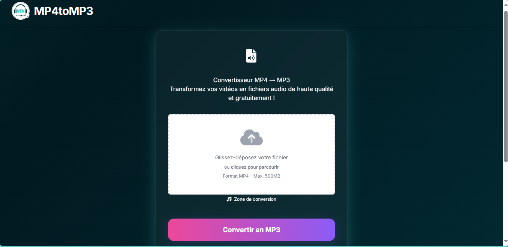
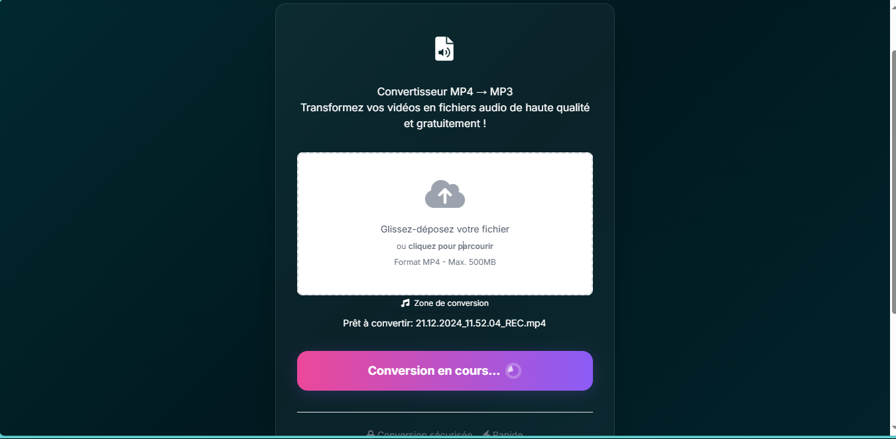

# 🎵 Convertisseur MP4 vers MP3

## Introduction

Ce projet est une application web avec Flask permettant de convertir des fichiers vidéo MP4 en fichiers audio MP3, directement depuis votre navigateur. L’objectif est de rendre la conversion accessible à tous, sans installation complexe et publicité

---

## Mise en contexte

De nombreux utilisateurs souhaitent extraire la piste audio de vidéos (cours, podcasts, conférences, musiques, etc.) pour les écouter sur leur téléphone ou lecteur MP3. Les solutions en ligne sont souvent limitées, peu sécurisées ou truffées de publicités. Ce projet propose une alternative locale, rapide et respectueuse de la vie privée.

---

## Problématique

- Extraire facilement l’audio d’une vidéo MP4 sans connaissances techniques.
- Éviter les outils en ligne peu fiables ou limités.
- Offrir une interface moderne, simple et agréable à utiliser.

---

## Technologies utilisées

- **Python 3**
- **Flask** (serveur web)
- **FFmpeg** (conversion audio/vidéo)
- **Tkinter** (lanceur graphique Windows)
- **HTML5 / CSS3 / JavaScript** (frontend moderne)
- **Tailwind CSS** (pour le style, via CDN ou build)
- **FontAwesome** (icônes)

---

## Fonctionnalités

- Upload de fichiers MP4 via glisser-déposer ou sélection classique.
- Conversion rapide en MP3 grâce à FFmpeg.
- Téléchargement automatique du fichier MP3 converti.
- Gestion intelligente des doublons : si un fichier existe déjà, le nouveau sera nommé `nom (1).mp3`, `nom (2).mp3`, etc.
- Animation de chargement pendant la conversion.
- Interface responsive et agréable.
- Lanceur graphique Windows (Tkinter) pour démarrer l’application sans terminal.

---

## Structure du projet

```
mp4ToMp3/
│
├── app.py                # Application Flask principale
├── launcher.py           # Lanceur graphique Windows (Tkinter)
├── requirements.txt      # Dépendances Python
├── bin/
│   └── ffmpeg.exe        # Binaire FFmpeg Windows
├── static/
│   ├── css/
│   │   └── style.css     # Feuilles de style 
│   ├── js/
│   │   └── script.js     
│   └── images/
│       └── logo.png      # Logo de l’application
├── templates/
│   └── index.html        # Page principale Flask
└── README.md             # Ce fichier
```

---

## Fonctionnement

### 1. **Lancement**

- Double-clique sur `launcher.py` (ou exécute-le avec Python).
- Clique sur "Lancer l'application".
- L’application s’ouvre dans ton navigateur.

### 2. **Conversion**

- Glisse-dépose ou sélectionne un fichier MP4.
- Clique sur **Convertir en MP3**.
- Patiente pendant la conversion (animation visible).
- Le téléchargement du MP3 démarre automatiquement.
- Si tu convertis plusieurs fois le même fichier, le nom sera incrémenté (`nom (1).mp3`, etc.).

---

## Démo

### Interface principale



### conversion



---

## Fonctionnalités futures possibles

- Conversion de plusieurs fichiers en lot.
- Support d’autres formats vidéo (avi, mov, mkv…).
- Choix du format de sortie (wav, ogg…).
- Extraction d’un extrait audio (début/fin).
- Interface multilingue.
- Version portable multiplateforme (Linux/Mac).

---

## Contribution

Les contributions sont les bienvenues !  
N’hésitez pas à ouvrir une issue ou une pull request pour proposer des améliorations, corriger des bugs ou ajouter des fonctionnalités.

---

## Auteur

Projet réalisé par **@Gauthier Shimatu** (le Shimatologue)  
Merci d’utiliser ce convertisseur et bon courage pour vos projets !

---